# javascript_basic_exercises
## Technology Used
- **JavaScript** Using this for a majority of the exercises
- **Node.js** Using this for a majority of the exercises
- **HTML**

Basic Javascript exercises! Check out the README below to see the gifs/screenshots of the solutions

## Exercise 1: Write a Javascript program to display the current day and time in the following format [dateAndTime folder]
**Expected Result**
Today is: Tuesday
Current time is: 10 PM : 30 : 38

This is the Javscript file screenshot (easier to see the work and results). Comments are just little notes I wrote mainly for myself.
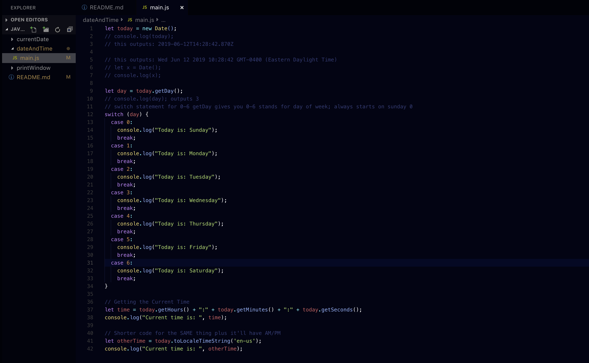
This is the result of the console.log's in the code
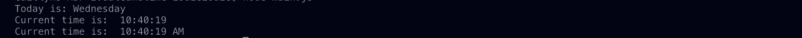

## Exercise 2: Write a Javascript program to print the contents of the current window [printWindow folder]
**Follow the screenshots and gifs to see what the process is!**

Here is the HTML page with a h1 tag and a p tag. I commented out the script tag because I wanted to see what the window would look like without JS code running.
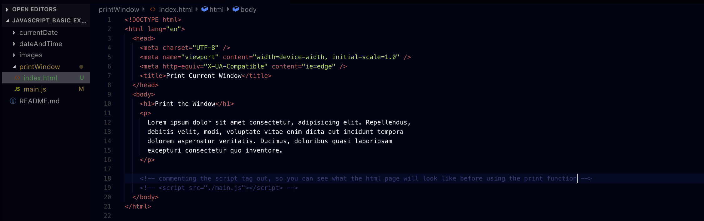
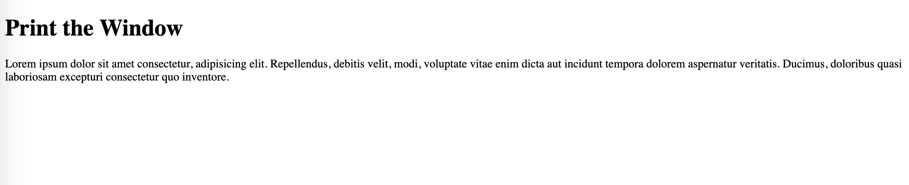

Here the  tag is uncommented from the html file. In the JS file you'll see the simple code, which opens the Print Dialog to print the current document
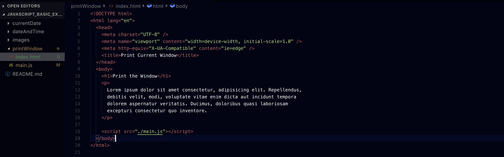
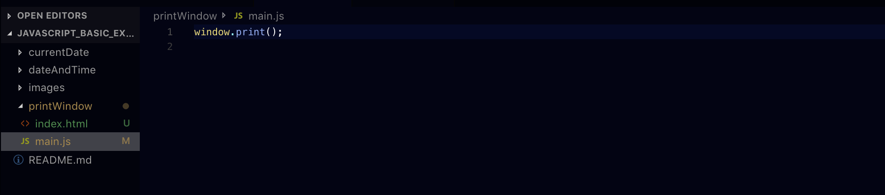
This is what the browser looks like when the page loads (and reloads). The print dialog pops up to print the current window
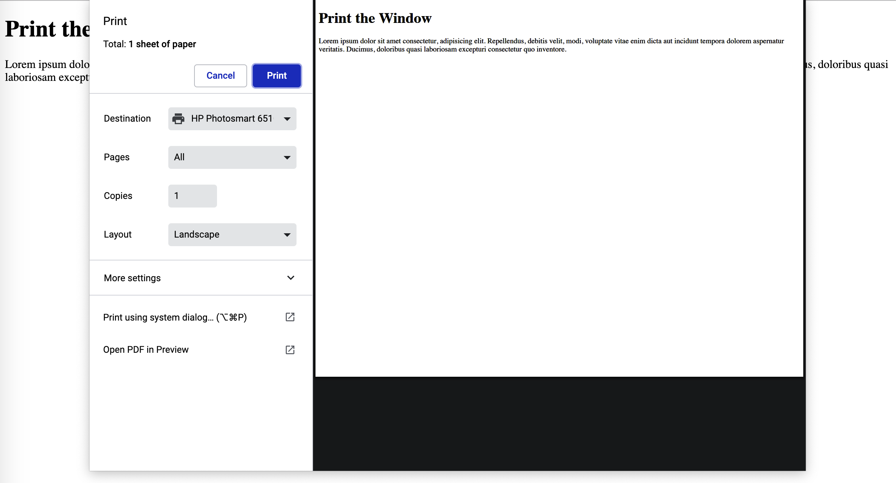

But what if I don't want the print dialog to pop up when I load/reload the page? I can add a button!
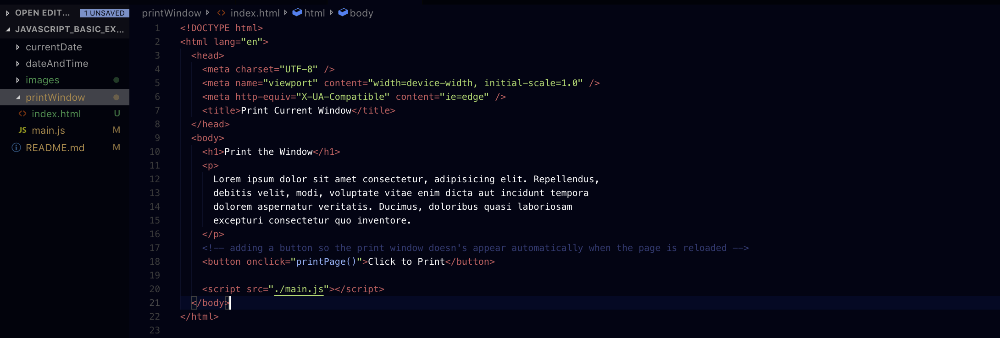
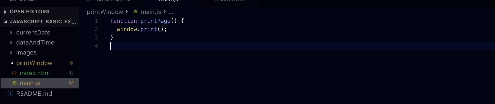

## Exercise 3: Write a Javascript program to get the current date [currentDate folder]
**Expected Result**
mm-dd-yyyy, mm/dd/yyyy or dd-mm-yyyy, dd/mm/yyyy

Here is the Javascript code and the process of how I came to figure this out. I definitely have a better feel of the date methods after this exercise. It's all about practice!
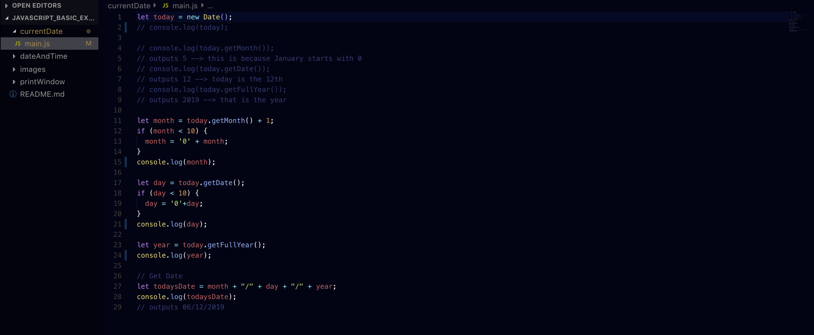
This is the result in the console. I left the other console.log's uncommented because I wanted to see what each variable was after the if statements
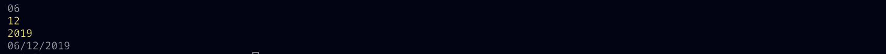

## Exercise 4: Write a Javascript program to find the area of a triangle where the lengths of the three of its sides are 5,6,7 [triangle folder]
If you're like me and you forgot math (face palming myself), google it. I found some sites that would calculate the area, but how could I program it to do it for me? 

Then I found 'Heron's Formula.' 

It's a method for calculating the area of a triangle when you know the lengths of all three sides! 

Let a,b,c be the lengths of the sides of the triangle. The area is given by: Area = sqrt(p(p-a)(p-b)(p-c)) where p is half the perimeter, (a+b+c)/2

Here is the Javascript code with some comments on how I thought through this exercise:
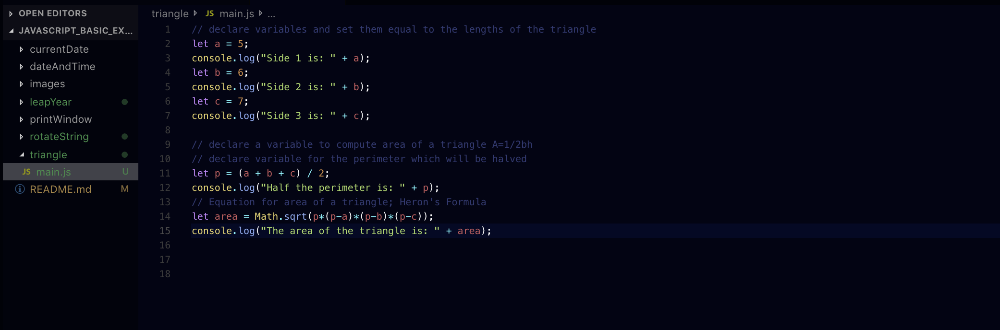

Here is the console where I console.log-ged the results:
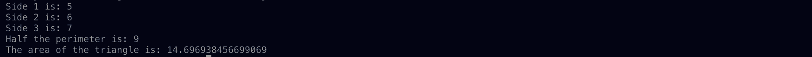

## Exercise 5: Write a Javascript program to rotate the string in right direction by periodically removing one letter from the end of the string and attaching it to the front [rotateString folder]
TBD - To Be Done

## Exercise 6: Write a Javascript program to determin whether a given year is a leap year in the Gregorian calendar [leapYear folder]
One thing to remember is: Leap Year 366 & Leap Year 365

So, I googled how to figure out if a year is a leap year:
- The year can be evenly divided by 4
- If the year can be evenly divided by 100, it is NOT a leap year, unless...
- The year is also evenly divisible by 400
- THEN it's a leap year

Here is the Javascript code: using a function and returning what you want run
- return: you can use return to immediately end execution of the current function and specifies a value to be returned to the function caller

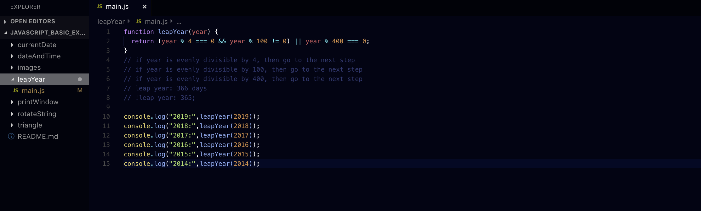

Here is the console where I console.log-ged the results:
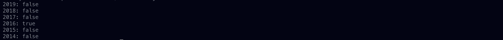

## Exercise 7: Write a Javascript program to find 1st January is being a Sunday between 2014 and 2050 [firstJanuary folder]
Because this exercise had to do with dates I new I would have to use 'new Date' in some capacity.

I first declared the variables x and y, and then set them equal to 2014 and 2050 respectively (this was just in case I wanted to change the years in the future)

Then I used a **for loop**. The conditions of the for statement, which consists of 3 optional expressions enclosed in parentheses and separated by semicolons:
- typically a basic for loop would look like this
  - for (var i = 0; i < array.length; i++) {}
- What I did:
  - substitute 'i' for 'yearStart' and set that equal to x (the start year)
  - then make sure 'yearStart' was less than or equal to (<=) the ending year 'y'
  - increment 'yearStart'
Once that's done, you can check to see if the expressions work by console.log-ing the statement
- like this: console.log(yearStart);
- this should increment and you'll see in your terminal the years 2014 to 2050

Now that the for loop has been started, next:
- need the **Date** method; **(below)**

Here is the syntax for using the Date method: 
- new Date(year, monthIndex [, day [, hours [, minutes [, seconds [, milliseconds]]]]]);
  - the parameters in the square brackets are optional; if not used the default values are used
- declare another variable, in this case 'z' and set that equal to the above method; let z = new Date() **(below)**

What I focused on were **'year'** and **'monthIndex'** 
- First Parameter: **year** is the integer value representing year
  - in this case, I used the variable 'yearStart'
- Second Parameter: **monthIndex** is the integer value representing the month; 0 for January to 11 for December
  - in this case, I used '0' for January
- Third Parameter: **day** is the integer value representing the day of the month
  - in this case, I used 1 because I want the 1st of January
Result: **line 20**

But there's more!

We need to find out **if** January 1st falls on a Sunday between the years 2014 and 2050
- getDay() method gives an integer value 0 for Sunday and 6 for Saturday
  - in this case, I want to use 0

So, do a strict comparison of 'z', getDay(), and 0 (Sunday)
Result: **line 22**

If this all happens to be true, then console.log() the years that meet these requirements!

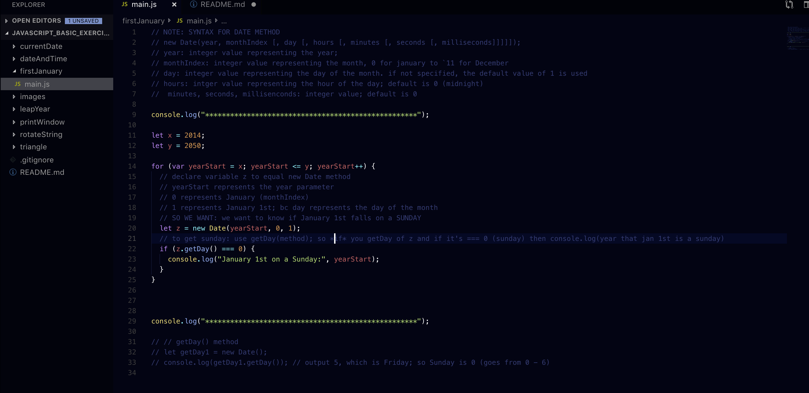

Here is the console where I console.log-ged the results:
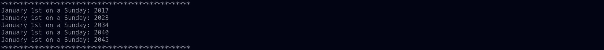

## Exercise 8: Write a Javascript program where the program takes a random integer between 1 to 10, the user is then prompted to input a guess number. If the user input matches with guess number, the program will display a message "Good Work" otherwise display a message "Not Matched" [randomNumber folder]
**ADD DESCRIPTION AND SCREENSHOTS**

## Exercise 9: Write a JavaScript program to calculate days left until next Christmas
**ADD DESCRIPTION AND SCREENSHOTS**

## Exercise 10: Write a JavaScript program to calculate multiplication and division of two numbers (input from user) [calculateNumbers]

## Exercise 11: Write a Javacsript program to convert tempeatures to and from Celsius, Fahrenheit
Formula: c/5 = (f-32)/9 

Where c = temperature in Celsius and f = temperature in Fahrenheit

## Exercise 12: Write a Javascript program to get the website URL (loading page)

